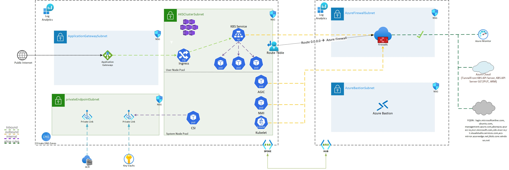
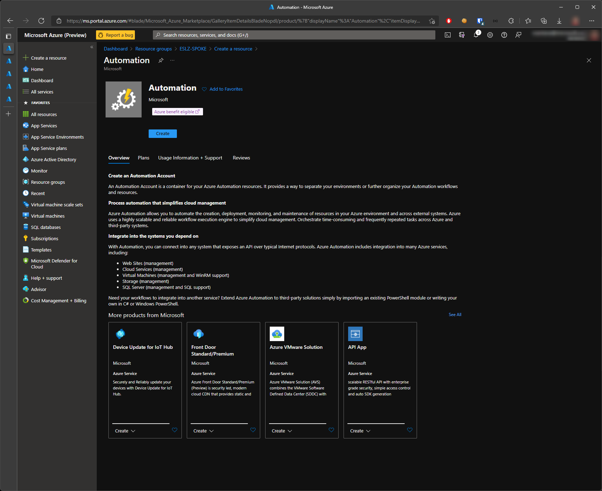
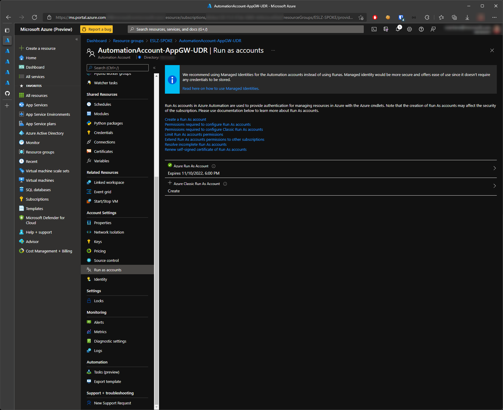

Using AKS kubenet egrees control with AGIC
==========================================

Table of Contents
=================

1. [Network Plugins](#network-plugins)

2. [IP address availability and exhaustion](https://github.com/Welasco/AKS-AGIC-UDR-AutoUpdate/blob/master/README.md#2-ip-address-availability-and-exhaustion)

3. [AGIC (Application Gateway Ingress Controller)](https://github.com/Welasco/AKS-AGIC-UDR-AutoUpdate/blob/master/README.md#3-agic-application-gateway-ingress-controller)

4. [Network topology](https://github.com/Welasco/AKS-AGIC-UDR-AutoUpdate/blob/master/README.md#3-network-topology)

5. [Synchronizing AKS egress control UDR with Application Gateway UDR](https://github.com/Welasco/AKS-AGIC-UDR-AutoUpdate/blob/master/README.md#5-synchronizing-aks-egress-control-udr-with-application-gateway-udr)

6. [Considerations](https://github.com/Welasco/AKS-AGIC-UDR-AutoUpdate/blob/master/README.md#6-considerations)

7. [Automation Account](https://github.com/Welasco/AKS-AGIC-UDR-AutoUpdate/blob/master/README.md#7-automation-account)

8. [Azure Monitor - Alert Rule](https://github.com/Welasco/AKS-AGIC-UDR-AutoUpdate/blob/master/README.md#8-azure-monitor---alert-rule)

9. [Confirmation and test](https://github.com/Welasco/AKS-AGIC-UDR-AutoUpdate/blob/master/README.md#9-confirmation-and-test)

10. [Conclusion](https://github.com/Welasco/AKS-AGIC-UDR-AutoUpdate/blob/master/README.md#10-conclusion)

## 1. Network Plugins

Kubernetes code does not include networking functionality, but instead relies in so called [network plugins](https://kubernetes.io/docs/concepts/extend-kubernetes/compute-storage-net/network-plugins/) to provide connectivity between nodes and pods. AKS offers two network plugins: [kubenet](https://kubernetes.io/docs/concepts/extend-kubernetes/compute-storage-net/network-plugins/#kubenet) and [Azure CNI](https://docs.microsoft.com/azure/aks/configure-azure-cni), which is a type of [Kubernetes CNI plugin](https://kubernetes.io/docs/concepts/extend-kubernetes/compute-storage-net/network-plugins/#cni).

- **kubenet**: By default, AKS clusters use kubenet, and an Azure virtual network and subnet are created for you. With kubenet, nodes get an IP address from the Azure virtual network subnet. Pods receive an IP address from a logically different address space to the Azure virtual network subnet of the nodes. Since the rest of the network is unaware of the pod IP address space, Network address translation (NAT) is required so that the pods can reach resources on the Azure virtual network. The source IP address of the traffic is NAT'd to the node's primary IP address. This approach greatly reduces the number of IP addresses that you need to reserve in your network space for pods to use.

    However, for intra-cluster communication NAT is not a solution, since it would prevent bidirectional communication between pods. Instead, [User-Defined Routes (UDR)](https://docs.microsoft.com/azure/virtual-network/virtual-networks-udr-overview#user-defined) in an Azure Route Table are used that tell each node where to forward packets with destination IPs in the pod address space. By default, the route table that contains these UDRs is created and maintained by the AKS service, but you have to the option to bring your own route table for custom route management (for example, if you need to specify a default route of your own). The following diagram shows how the AKS nodes receive an IP address in the virtual network subnet, but not the pods:

    

- **Azure CNI**: With [Azure Container Networking Interface (CNI)](https://github.com/Azure/azure-container-networking/blob/master/docs/cni.md), every pod gets an IP address from the subnet and can be accessed directly. These IP addresses are unique across the network space, and must be planned in advance. Each node has a configuration parameter for the maximum number of pods that it supports. The equivalent number of IP addresses per node are then reserved up front for that node. This approach requires more planning, and can lead to IP address exhaustion or the need to rebuild clusters in a larger subnet as your application demands grow. You can configure the maximum pods deployable to a node at cluster create time or when creating new node pools. If you don't specify maxPods when creating new node pools, you receive a default value of 30 for Azure CNI.

## 2. IP address availability and exhaustion
With Azure CNI, a common issue is the assigned IP address range is too small to then add additional nodes when you scale or upgrade a cluster. The network team may also not be able to issue a large enough IP address range to support your expected application demands.

As a compromise, you can create an AKS cluster that uses kubenet and connect to an existing virtual network subnet. This approach lets the nodes receive defined IP addresses, without the need to reserve a large number of IP addresses up front for all of the potential pods that could run in the cluster.

With kubenet, you can use a much smaller IP address range and be able to support large clusters and application demands. For example, even with a /27 IP address range on your subnet, you could run a 20-25 node cluster with enough room to scale or upgrade. This cluster size would support up to 2,200-2,750 pods (with a default maximum of 110 pods per node). The maximum number of pods per node that you can configure with kubenet in AKS is 110.

The following basic calculations compare the difference in network models:

- kubenet - a simple /24 IP address range can support up to 251 nodes in the cluster (each Azure virtual network subnet reserves the first three IP addresses for management operations)
This node count could support up to 27,610 pods (with a default maximum of 110 pods per node with kubenet)
- Azure CNI - that same basic /24 subnet range could only support a maximum of 8 nodes in the cluster
This node count could only support up to 240 pods (with a default maximum of 30 pods per node with Azure CNI)

## 3. AGIC (Application Gateway Ingress Controller)
The Application Gateway Ingress Controller (AGIC) is a Kubernetes application, which makes it possible for [Azure Kubernetes Service (AKS)](https://azure.microsoft.com/services/kubernetes-service/) customers to leverage Azure's native [Application Gateway](https://azure.microsoft.com/services/application-gateway/) L7 load-balancer to expose cloud software to the Internet. AGIC monitors the Kubernetes cluster it is hosted on and continuously updates an Application Gateway, so that selected services are exposed to the Internet.

The Ingress Controller runs in its own pod on the customer’s AKS. AGIC monitors a subset of Kubernetes Resources for changes. The state of the AKS cluster is translated to Application Gateway specific configuration and applied to the [Azure Resource Manager (ARM)](https://docs.microsoft.com/en-us/azure/azure-resource-manager/management/overview).

AGIC helps eliminate the need to have another load balancer/public IP in front of the AKS cluster and avoids multiple hops in your datapath before requests reach the AKS cluster. Application Gateway talks to pods using their private IP directly and does not require NodePort or KubeProxy services. This also brings better performance to your deployments.

Ingress Controller is supported exclusively by Standard_v2 and WAF_v2 SKUs, which also brings you autoscaling benefits. Application Gateway can react in response to an increase or decrease in traffic load and scale accordingly, without consuming any resources from your AKS cluster.

[***Unsupported scenario***](https://docs.microsoft.com/en-us/azure/application-gateway/configuration-infrastructure#supported-user-defined-routes): ***Currently Application Gateway does not support any scenario where 0.0.0.0/0 needs to be redirected through any virtual appliance, a hub/spoke virtual network, or on-premises (forced tunneling).***

[AKS can be deployed in a secure environment with egress control](https://docs.microsoft.com/en-us/azure/aks/egress-outboundtype). It's done using a UDR with a route 0.0.0.0/0 pointing to a Network Virtual Appliance or any other router/firewall like [Azure Firewall](https://docs.microsoft.com/en-us/azure/aks/limit-egress-traffic#restrict-egress-traffic-using-azure-firewall).

***Since Application Gateway doesn't support UDR with a route 0.0.0.0/0 and it's a requirement for AKS egress control [you cannot use the same UDR for both subnets](https://github.com/Azure/application-gateway-kubernetes-ingress/blob/master/docs/how-tos/networking.md#with-kubenet) (Application Gateway subnet and AKS subnet).***

## 4. Network topology
In a secure deployment Application Gateway and AKS (using egress control) will be on its own subnet and as described above it's not possible to share the same UDR for both of them.

In this case it's required to create a dedicated UDR for Application Gateway subnet but it brings a challenge to keep the AKS (kubenet) auto managed UDR to be in sync with Application Gateway UDR.

## 5. Synchronizing AKS egress control UDR with Application Gateway UDR

Every time there is an event of scale in the AKS cluster a new route entry will be automatically created in the AKS UDR with the POD address space of the new Node. This route is required for Application Gateway be able to access the backend POD to proxy the traffic. The same process happen when there is an event of scale-in where an AKS Node is removed from the cluster.

Using Azure Monitor Alerts is possible to create an Alert Rule to trigger an Automation Account every single time there is a change in the AKS UDR. The Automation Account can receive this event (webhook) and invoke a PowerShell script to sync the desired changes between both UDRs (Application Gateway UDR and AKS UDR).

By following his approach you can safely use AKS egress control with AGIC in a auto managed scenario.

## 6. Considerations

This article assume you are using AKS with VMSS not VMs. The PowerShell runbook are filtering the routes based in the name of the VMSS instance name considering it will start with "aks*" and it contains "*vmss*" in the name of each route. Any other route not matching the filter will not be evaluated.

## 7. Automation Account

Create an Automation Account following the steps bellow:

1. In the [portal](https://portal.azure.com), Click the **Create a resource** button found in the upper left corner of Azure portal.

2. Select **IT & Management Tools**, and then select **Automation**. You can also search for "Automation Accounts" and create it from there.

    

3. Enter the Resource Group, Automation account name and Region and click next.

    

4. In Advanced tab don't change anything and click next.

    

5. Go to Review + Create and click Create.

    

6. Open the created Automation Account and click in Run as accounts in the left blade.

    

7. Under Add Azure Run As Account click Create.

    

8. At the end you will see the Run As Account expiration date.

    

9. Click in Runbooks in the left blade and click Create a runbook.

    

10. In Create a runbook add a runbook name, select Runbook type "PowerShell" and Runtime version 5.1. Click Create.

    

11. Under Edit PowerShell Runbook paste the PowerShell code which will keep both UDRs (AKS kubenet UDR and Application Gateway UDR) in sync. You can copy it from here: [UDRAutoUpdate](UDRAutoUpdate.ps1). After paste the code click in Save and Publish.

    

## 8. Azure Monitor - Alert Rule

Create a Azure Monitor Aler Rule to invoke the Runbook for any change/event in AKS UDR.

1. In Azure Portal look for Monitor.

    

2. Click in Alerts and in Alert rules.

    

3. In Alert rules, Click Create.

    

4. In Create alert rule, click Select scope.

    

5. In Select a resource, select your subscription under "Filber by subscription" and select Route Table under "Filter by resource type".

    

6. Select the UDR used by AKS and click Done.

    

7. Back to Create Alert rule, click Next.

    

8. Under Condition tab, click Add condition. In Select a signal select "All Administrative operations" and click Done.

    

9. Back in Condition tab, under Event Level select "Informational" and click Next.

    

10. Under Actions tab click Create Action Group. Select a Resource Group, and give a Action group name and a Display Name. Click Next.

    

11. Under Notifications tab click Next.

    

12. Under Actions tab, select Action Type "Automation Runbook", it will bring you to a Configure Runbook screen.

    

13. Under Configure Runbook, Runbook source as User, select the subscription you created the Runbook, under Automation account select the Automation account created previously and under Runbook select the runbook created previously. Now click in Parameters.

    

14. Under Parameters, add the Application Gateway UDR Resource Group Name and add the Application Gateway UDR to be kept in sync. Click in OK.

    

15. Back to configure Runbook, click OK.

    

16. Back to Create action group, click Review Create.

    

17. Review the information and click Create.

    

18. Back to Create alert rule click Next.

    

19. Under Details tab, select the Resource Group where the Alert Rule will be created and add a Alert rule name. Click in Review Create.

    

20. Review all the information and click Create.

    

21. Back to Alert rules. It will take a few seconds until the new Alert shows up. You can click refresh until it get's populated.

    

22. asdf asdf

    

## 9. Confirmation and test

You now have a Runbook with an Alert Rule. The Runbook will be executed everything single time a change happen in AKS UDR. In the steps bellow you will confirm that everthing is worked as expected by scaling in/out your AKS cluster.

1. In Azure Portal look for the Application Gateway UDR that will be in sync with AKS UDR. It's expected to be empty andd associated with the Application Gateway Subnet.

    

2. In Azure Portal confirm that AKS UDR has a default routing 0.0.0.0/0 pointing to a NVA (or Azure Firewall). If the AKS cluster was already created it's expected to have at least one routing entry pointing to the PODs address space of the respective node.

    

3. In Azure Portal go to the AKS cluster, click in Node pools. Select defaultpool and click "Scale node pool".

    

4. Under Scale node pool, increase/decrease the amount of nodes and click Apply.

    

5. Wait until the process has finished.

    

6. Go back to the AKS UDR and confirm that a new route entry was created/deleted based in the scale operation (in/out) you did.

    

7. In Azure Portal go to the Automation Account, and Runbooks. Select the runbook created previously and look at Recent Jobs. In a few seconds a new job will shows up since the AKS UDR was changed. Click in the Running job.

    

8. Under Input tab, is expected to see the Application Gateway UDR Resource Group localtion and the Application Gateway UDR Name. In Webhookdata it's expected to see the JSON webhook content where the PowerShell runbook script will use to parser the event.

    

9. Under Output tab you can see the log of the PowerShell runbook script.

    

10. Now bo back to Application Gateway UDR. You will see the route entries that was created based in the AKS scaling event.

    

## 10. Conclusion

Until Azure Application Gateway V2 (which is a requirement for AGIC) supports a UDR with routing 0.0.0.0/0, it's very hard to use AKS with kubenet network plugin since it depends on the Azure Route Tables (UDR) to route traffic to respective PODs in a Node. Using the approach above you can achieve an auto managed environment by keeping the Application Gateway UDR always in sync with AKS UDR Node routes.